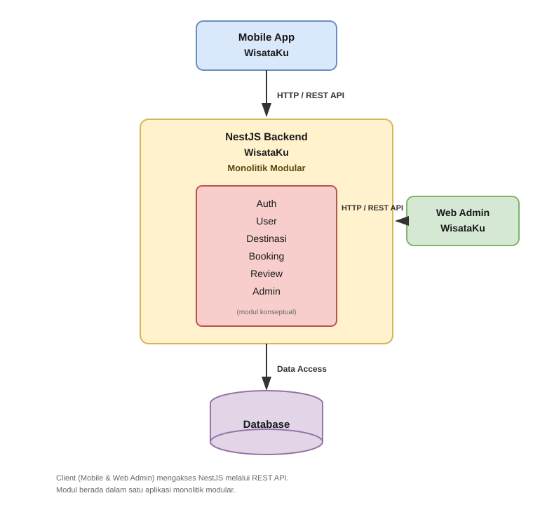
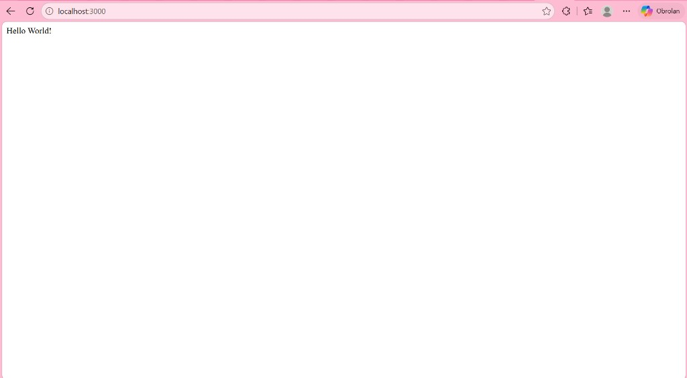
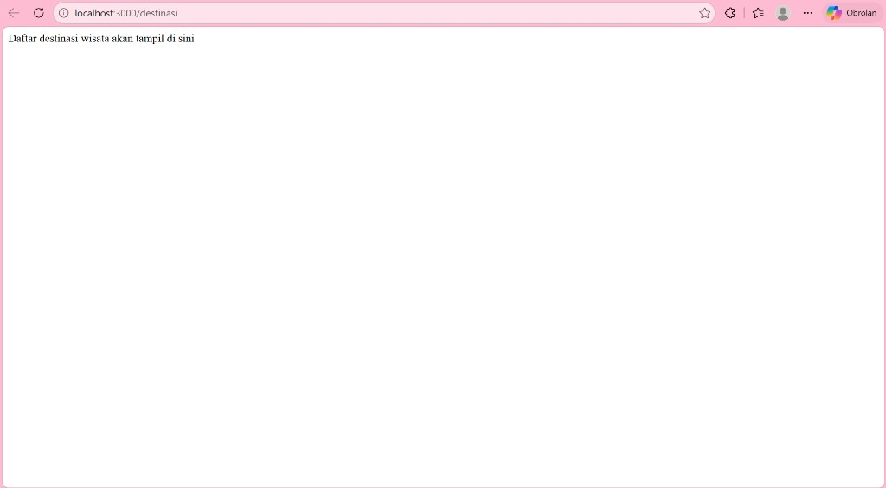

# TUGAS 1
# ANALISIS ARSITEKTUR WEB SERVICE

**Studi Kasus Aplikasi WisataKu**

---

## Halaman Cover

**LAPORAN PRAKTIKUM**  
**TUGAS 1**  
**ANALISIS ARSITEKTUR WEB SERVICE**  
**STUDI KASUS APLIKASI WISATAKU**

Disusun oleh:  
**Baiq Agestia Cahya Ilami**  
**NIM: TI21240005**

**PROGRAM STUDI TEKNIK INFORMATIKA**  
**SEKOLAH TINGGI MANAJEMEN INFORMATIKA DAN KOMPUTER**  
**STMIK LOMBOK**  
**PRAYA**  
**2026**

---

## BAB 1 PENDAHULUAN

### 1.1 Latar Belakang

Perkembangan aplikasi berbasis layanan menuntut adanya backend yang mampu menyediakan data secara terpusat dan dapat diakses oleh lebih dari satu jenis klien. WisataKu merupakan aplikasi yang dirancang untuk menyediakan informasi serta pengelolaan destinasi wisata. Agar layanan tersebut dapat digunakan melalui aplikasi mobile maupun web admin, diperlukan web service sebagai penghubung antara antarmuka pengguna dan logika bisnis di sisi server.

Pada praktikum ini, web service dibangun menggunakan framework NestJS. Backend tersebut berperan menerima permintaan dari klien, memproses logika aplikasi, dan mengembalikan respons melalui REST API. Pendekatan ini memungkinkan aplikasi mobile dan web admin menggunakan layanan yang sama tanpa bergantung pada detail implementasi internal backend.

### 1.2 Tujuan

Penulisan laporan ini bertujuan untuk:

1. menjelaskan konsep arsitektur monolitik modular pada backend NestJS;
2. menganalisis alasan pemilihan arsitektur monolitik modular pada tahap awal pengembangan WisataKu;
3. menjelaskan hubungan antara klien dan backend melalui REST API; serta
4. menyusun rancangan arsitektur web service yang sesuai dengan ruang lingkup praktikum.

### 1.3 Ruang Lingkup

Ruang lingkup praktikum dibatasi pada hal-hal berikut.

**Tabel 1. Ruang Lingkup Praktikum**

| No | Cakupan | Keterangan |
| --- | --- | --- |
| 1 | Project backend | `wisataku-api` berbasis NestJS |
| 2 | Endpoint yang diuji | `GET /` dan `GET /destinasi` |
| 3 | Pola arsitektur | Monolitik modular |
| 4 | Di luar cakupan | Database, autentikasi, Prisma, JWT, Docker, dan microservices |

---

## BAB 2 IMPLEMENTASI PRAKTIKUM

### 2.1 Identitas Project

Ringkasan project yang digunakan dalam praktikum disajikan pada Tabel 2.

**Tabel 2. Identitas Project WisataKu**

| Aspek | Keterangan |
| --- | --- |
| Nama aplikasi | WisataKu |
| Nama project | `wisataku-api` |
| Framework | NestJS |
| Arsitektur | Monolitik modular |
| Gaya API | REST |
| Perintah menjalankan server | `npm run start:dev` |
| Alamat pengujian | `http://localhost:3000` |

Project disusun sebagai satu aplikasi NestJS. Fitur dipisahkan ke dalam module, tetapi tetap dijalankan dalam satu proses aplikasi.

### 2.2 Implementasi Endpoint

Hasil implementasi endpoint pada praktikum ini disajikan pada Tabel 3.

**Tabel 3. Endpoint yang Telah Diimplementasikan**

| No | Endpoint | Method | Komponen terkait | Respons |
| --- | --- | --- | --- | --- |
| 1 | `/` | GET | `AppController`, `AppService` | `Hello World!` |
| 2 | `/destinasi` | GET | `DestinasiModule`, `DestinasiController` | `Daftar destinasi wisata akan tampil di sini` |

`DestinasiModule` telah didaftarkan pada `AppModule` sehingga endpoint `/destinasi` dapat diakses. Pada tahap ini, respons masih berupa teks sederhana sesuai materi praktikum. Database dan logika bisnis lanjutan belum diimplementasikan.

---

## BAB 3 ANALISIS ARSITEKTUR

### 3.1 Arsitektur Monolitik Modular

Arsitektur monolitik modular menempatkan seluruh backend dalam satu aplikasi. Unit deployment-nya tunggal, namun struktur kode tetap dibagi berdasarkan modul agar lebih teratur dan mudah dikembangkan.

NestJS mendukung pendekatan tersebut karena setiap domain dapat memiliki module, controller, dan service tersendiri. Pada WisataKu, penerapan pola ini terlihat dari penggunaan satu project `wisataku-api`, satu titik masuk aplikasi pada `main.ts`, serta adanya `DestinasiModule` sebagai contoh pembagian modul. Komunikasi antar bagian dilakukan melalui import module dan dependency injection, bukan melalui jaringan antar service.

### 3.2 Alasan Memilih Monolitik Modular

Pertanyaan yang dianalisis pada bagian ini adalah: mengapa arsitektur monolitik modular dipilih sebagai tahap awal pengembangan WisataKu, bukan langsung microservices?

Jawaban atas pertanyaan tersebut dirangkum pada Tabel 4.

**Tabel 4. Alasan Pemilihan Arsitektur Monolitik Modular**

| Aspek | Penjelasan |
| --- | --- |
| Tahap pengembangan | Project masih berada pada tahap awal sehingga membutuhkan fondasi yang sederhana dan mudah diuji. |
| Pengembangan | Mahasiswa cukup mengelola satu aplikasi NestJS dan satu alur request-response. |
| Deployment | Cukup menjalankan satu service, misalnya dengan `npm run start:dev`. |
| Debugging | Log dan alur pemanggilan fungsi berada dalam satu proses sehingga lebih mudah dilacak. |
| Komunikasi antar modul | Dilakukan secara lokal melalui import dan dependency injection. |
| Kompleksitas operasional | Belum memerlukan service discovery, orkestrasi container, atau monitoring terdistribusi. |
| Skala fitur saat ini | Fitur masih terbatas pada `GET /` dan `GET /destinasi`. |
| Peluang pengembangan | Modul yang sudah terpisah secara logis dapat diekstraksi menjadi service mandiri di masa depan. |

Microservices tetap memiliki manfaat, terutama pada sistem berskala besar yang membutuhkan skalabilitas per layanan. Namun, manfaat tersebut disertai kompleksitas infrastruktur yang belum sebanding dengan kebutuhan praktikum saat ini. Oleh karena itu, monolitik modular digunakan sebagai langkah awal, bukan sebagai penolakan terhadap microservices.

### 3.3 Perbandingan Monolitik Modular dan Microservices

Perbandingan kedua pendekatan disajikan pada Tabel 5.

**Tabel 5. Perbandingan Monolitik Modular dan Microservices**

| Aspek | Monolitik Modular | Microservices |
| --- | --- | --- |
| Struktur aplikasi | Satu aplikasi dengan banyak module | Banyak service mandiri |
| Deployment | Satu unit deploy | Banyak unit deploy |
| Komunikasi | Lokal melalui import atau DI | Melalui jaringan, misalnya API atau message broker |
| Debugging | Lebih sederhana | Lebih kompleks karena tersebar |
| Kompleksitas operasional | Lebih rendah di awal | Lebih tinggi sejak awal |
| Skalabilitas | Pada aplikasi secara keseluruhan | Dapat dilakukan per service |
| Pengelolaan infrastruktur | Lebih ringan | Lebih besar |

Kedua pendekatan dapat digunakan sesuai kebutuhan. Pada tahap awal WisataKu, monolitik modular lebih sesuai karena ruang lingkup sistem masih terbatas.

---

## BAB 4 ARSITEKTUR WISATAKU

### 4.1 Klien dan Backend

WisataKu dirancang untuk dilayani oleh satu backend NestJS yang diakses oleh dua jenis klien. Peran masing-masing komponen dijelaskan pada Tabel 6.

**Tabel 6. Peran Klien dan Backend**

| Komponen | Jenis | Peran |
| --- | --- | --- |
| Mobile App WisataKu | Klien | Digunakan pengguna umum untuk mengakses destinasi dan fitur terkait |
| Web Admin WisataKu | Klien | Digunakan pengelola untuk administrasi data |
| NestJS Backend | Server | Memproses permintaan, menjalankan logika aplikasi, dan menyediakan REST API |
| Database | Penyimpanan data | Menyimpan data aplikasi pada tahap pengembangan berikutnya |

### 4.2 Alur Komunikasi

Alur komunikasi antar komponen disajikan pada Tabel 7.

**Tabel 7. Alur Komunikasi Arsitektur WisataKu**

| No | Dari | Ke | Protokol / jalur |
| --- | --- | --- | --- |
| 1 | Mobile App | NestJS Backend | HTTP / REST API |
| 2 | Web Admin | NestJS Backend | HTTP / REST API |
| 3 | NestJS Backend | Database | Data access |

Backend NestJS menjadi pusat layanan. Request dari klien diproses di backend, kemudian respons dikembalikan melalui REST API. Pada praktikum saat ini, akses database belum diimplementasikan dan baru digambarkan secara arsitektural.

### 4.3 Modul Backend

Pembagian modul backend disusun sebagai rancangan awal. Status tiap modul dijelaskan pada Tabel 8.

**Tabel 8. Rancangan Modul Backend dan Status Implementasi**

| Modul | Peran | Status |
| --- | --- | --- |
| Auth | Autentikasi dan otorisasi | Rancangan |
| User | Pengelolaan data pengguna | Rancangan |
| Destinasi | Pengelolaan dan penyajian destinasi wisata | Telah diimplementasikan |
| Booking | Pemesanan destinasi | Rancangan |
| Review | Ulasan pengguna | Rancangan |
| Admin | Fungsi pengelolaan panel admin | Rancangan |

Seluruh modul dirancang berada dalam satu aplikasi NestJS. Pada praktikum ini, modul yang telah dibuat adalah Destinasi beserta controller-nya.

### 4.4 Database

Database digambarkan sebagai komponen penyimpanan data yang akan diakses backend. Jenis database tertentu belum ditentukan dan belum diimplementasikan pada tahap praktikum ini.

---

## BAB 5 DIAGRAM ARSITEKTUR

Diagram arsitektur WisataKu disusun berdasarkan berkas `docs/wisataku-arsitektur.drawio` dan ditampilkan pada Gambar 1.

**Gambar 1. Arsitektur Web Service WisataKu**

Diagram tersebut menunjukkan bahwa Mobile App dan Web Admin terhubung ke NestJS Backend melalui REST API. Di dalam backend terdapat rancangan modul Auth, User, Destinasi, Booking, Review, dan Admin. Backend kemudian terhubung ke database melalui jalur data access.

---

## BAB 6 HASIL DAN VERIFIKASI

Pengujian dilakukan dengan menjalankan aplikasi menggunakan perintah `npm run start:dev` pada alamat `http://localhost:3000`. Hasil pengujian disajikan pada Tabel 9.

**Tabel 9. Hasil Verifikasi Endpoint**

| No | Endpoint | Method | Hasil pengujian | Status |
| --- | --- | --- | --- | --- |
| 1 | `/` | GET | `Hello World!` | Berhasil |
| 2 | `/destinasi` | GET | `Daftar destinasi wisata akan tampil di sini` | Berhasil |

### Bukti Pengujian

Bukti pengujian melalui browser ditampilkan pada Gambar 2 dan Gambar 3.

**Gambar 2. Hasil pengujian GET / yang menampilkan Hello World!**

**Gambar 3. Hasil pengujian GET /destinasi yang menampilkan teks Daftar destinasi wisata akan tampil di sini**

---

## BAB 7 KESIMPULAN

Berdasarkan hasil praktikum dan analisis arsitektur, dapat disimpulkan bahwa WisataKu menggunakan pendekatan monolitik modular sebagai tahap awal pengembangan backend. Pendekatan tersebut memudahkan pengerjaan, pengujian, dan pengelolaan sistem ketika fitur masih terbatas.

Aplikasi mobile dan web admin dapat menggunakan backend NestJS yang sama melalui REST API. Apabila kebutuhan sistem meningkat, arsitektur masih dapat dikembangkan secara bertahap, termasuk mempertimbangkan microservices jika skala dan kompleksitas aplikasi sudah memerlukannya. Pada tahap ini, sistem masih merupakan fondasi praktikum dan belum diklaim sebagai sistem produksi.

---

## Referensi

1. Dokumentasi analisis internal: `docs/tugas-1-analisis-arsitektur.md`
2. Diagram arsitektur: `docs/wisataku-arsitektur.drawio`
3. Implementasi project `wisataku-api`, khususnya endpoint `GET /` dan `GET /destinasi`
